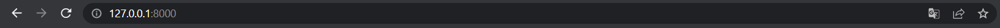
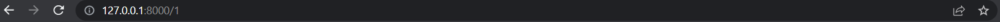
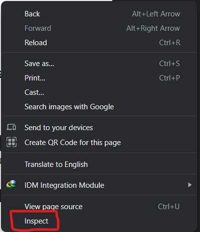
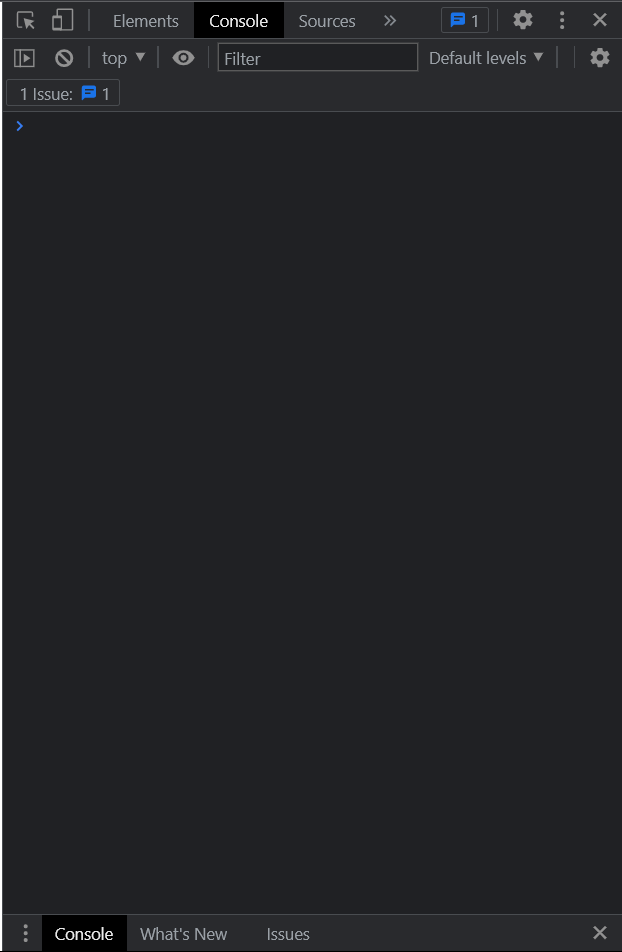
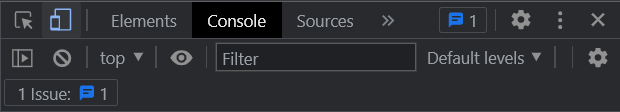
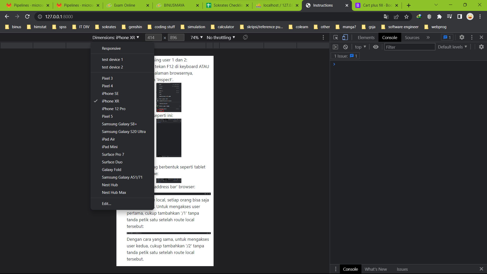

## Halo! Selamat datang di aplikasi milik 2440067175 - Ariel Sefrian khusus untuk UTS Web Programming 2023.

Aplikasi ini berbasis mobile phone, sehingga apabila mau melihat tampilannya, Anda <strong>WAJIB</strong> mengubah tampilan browser menjadi mobile phone juga. Disarankan untuk memilih mobile phone: Iphone XR. Cara untuk mengubah tampilan browsernya dapat dilihat di file README ini.

### Cara setup aplikasi:
<ol>
<li>
Jalankan `composer install`
</li>

 

<li>
Copy file `.env.example`, kemudian paste di folder projectnya dan hapus `.example`, sehingga hanya tersisa `.env`
</li>

 

<li>
Apabila file `.env` sudah ada, jalankan `php artisan key:generate` di terminal
</li>

 

<li>
Setelah itu, jalankan `php artisan cache:clear` dan `php artisan config:clear` di terminal
</li>

 

<li>
Lalu, jalankan `npm install` di terminal, tunggu sampai selesai install
</li>

 

<li>
Buka XAMPP, nyalakan Apache dan MySQL
</li>

 

<li>
Pada MySQL, klik Admin.
</li>

 

<li>
Anda akan di-direct ke halaman local phpMyAdmin. Di halaman itu, buat database baru dengan nama 'uts_2440067175' supaya sama dengan yang di dalam .env
</li>

 

<li>
Kemudian jalankan `php artisan migrate:fresh --seed` di terminal, tunggu sampai selesai migrate
</li>

 

<li>
Jalankan `npm run watch-poll` di terminal
</li>

 

<li>
Buka terminal baru, jalankan `php artisan serve`, jadi ada 2 terminal yang masing-masing menjalankan `npm run watch poll` dan `php artisan serve`
</li>

 

<li>
Navigasi ke localhost yang digenerate oleh `php artisan serve`, anda akan di-direct ke instruksi selanjutnya.
</li>
</ol>

### Berikut adalah cara melihat User Interface untuk masing-masing user 1 dan 2:
<ol>
<li>
Perhatikan di 'address bar' browser:

 

Terdapat route local, setiap orang bisa saja berbeda-beda. Untuk mengakses user pertama, cukup tambahkan '/1' tanpa tanda petik satu setelah route local tersebut:

Dengan cara yang sama, untuk mengakses user kedua, cukup tambahkan '/2' tanpa tanda petik satu setelah route local tersebut.
</li>
 
<li>
Lalu pada browser, tekan F12 di keyboard ATAU klik kanan di halaman browsernya, kemudian pilih 'Inspect'.

</li>
 
<li>
Akan muncul seperti ini:

Tekan icon yang berbentuk seperti tablet dan handphone:

Kemudian di bagian Dimensions, pilih Iphone XR:

</li>
</ol>

### Copyright &copy; --- 2440067175 - Ariel Sefrian
